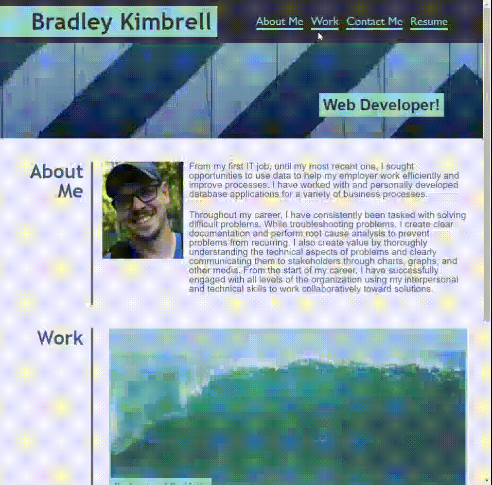

# professional-portfolio
## Site Description
This website contains a header with my name and a navigation bar. It also has an "About Me" section describing some of my qualifications, examples of projects I've completed, and methods to contact me. You will find my resume linked at the top.
## Mock-up
The animation below shows that the navigation buttons link to the sections and that an overlay disappears from the cards when the mouse hovers over them.

